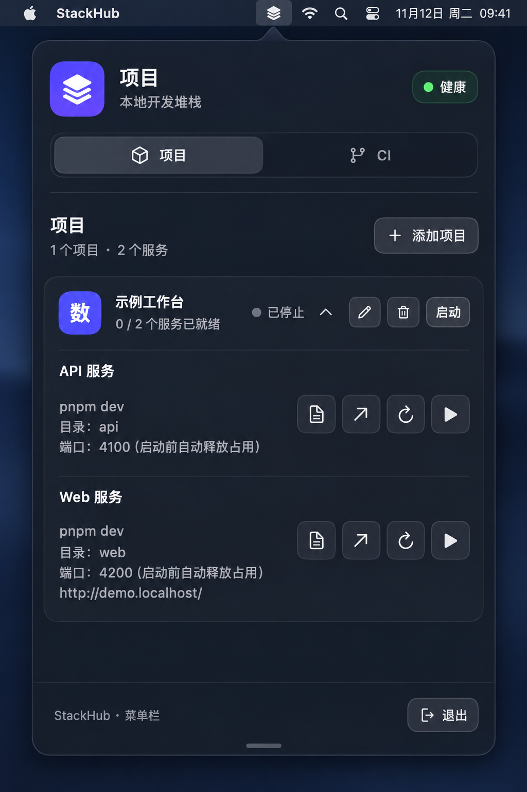
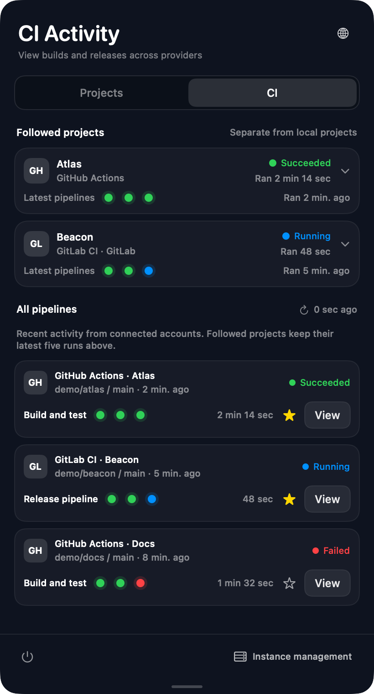
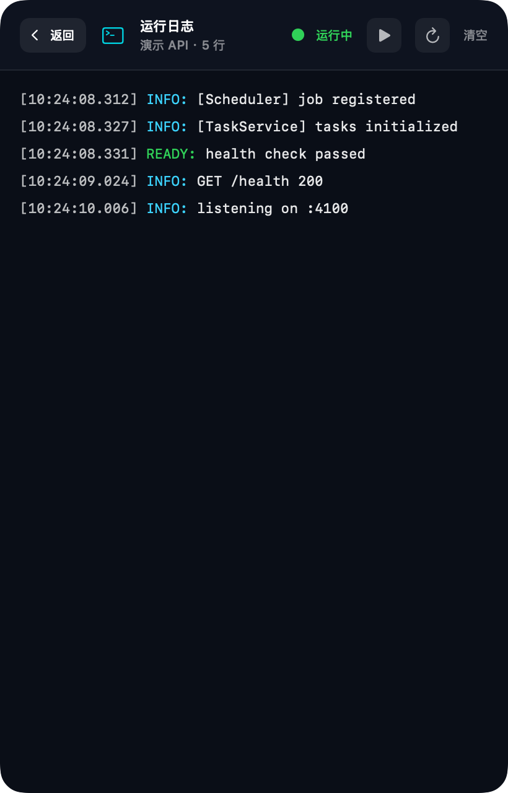

# StackHub

[English](README.md) | **简体中文**

StackHub 是一款使用 SwiftUI 构建的原生 macOS 菜单栏应用，将命令执行、Shell 脚本运行、本地服务与进程管理，以及 GitHub Actions、GitLab CI 流水线监控集中在一个面板中。

## 界面预览

<table>
  <tr>
    <th>本地项目与服务</th>
    <th>CI 活动</th>
    <th>全屏运行日志</th>
  </tr>
  <tr>
    <td width="33%" valign="top"></td>
    <td width="33%" valign="top"></td>
    <td width="33%" valign="top"></td>
  </tr>
</table>

*英文版界面，使用示例数据。*

## 功能

- **本地服务** — 启动、停止和重启项目服务，自定义命令、工作目录和端口。启动时加载 `.zshrc`，沿用 jenv、nvm 等工具的环境配置。
- **独立运行环境** — 为每个服务选择已安装的 JDK、Node.js 版本或指定路径，无需安装版本管理器。
- **实时日志** — 在独立日志页面查看服务输出，支持 ANSI 彩色日志。
- **CI 监控** — 关注 GitHub Actions 与多个 GitLab 实例，各自独立刷新，离线时保留缓存。
- **凭据保护** — GitHub 和 GitLab Token 保存在 macOS 钥匙串中。
- **应用内更新** — 每小时检查更新，有新版时点击蓝色下载图标即可安装并重启。
- **双语界面** — 支持简体中文和英文切换。

## 安装

需要 **macOS 14 或更高版本**，发布包适用于 **Apple Silicon**。

1. 从 [GitHub Releases](https://github.com/chenbstack/StackHub/releases/latest) 下载 ZIP。
2. 解压后将 `StackHub.app` 移入“应用程序”。
3. 启动并点击菜单栏图标，在“项目”中添加本地服务，或在“CI”中连接 GitHub 和 GitLab。

配置的端口会在服务启动前释放，请只填写属于该服务的端口。退出或安装更新会停止托管服务，需要时请重新启动服务。

### JDK 与 Node.js

编辑服务时展开“运行环境”。默认模式沿用系统 Shell 配置，不额外读取项目版本文件、不覆盖运行时环境，也不输出默认运行时日志。需要指定版本时可选择已安装版本或自定义路径，面板显示实际版本、路径和来源。

自动检测本机 JDK、Homebrew Node.js 及 jenv/nvm 已安装版本，也支持自定义路径。指定版本缺失时阻止启动，不自动下载或静默换用其他版本。修改后重启该服务生效，不改变其他服务或终端的环境。

## 从源码运行

需要 Xcode 和 Swift 5.9 或更高版本。

```bash
cd swift-prototype
swift run StackHub
```

构建应用包可使用 [scripts/package-app.sh](scripts/package-app.sh)。
